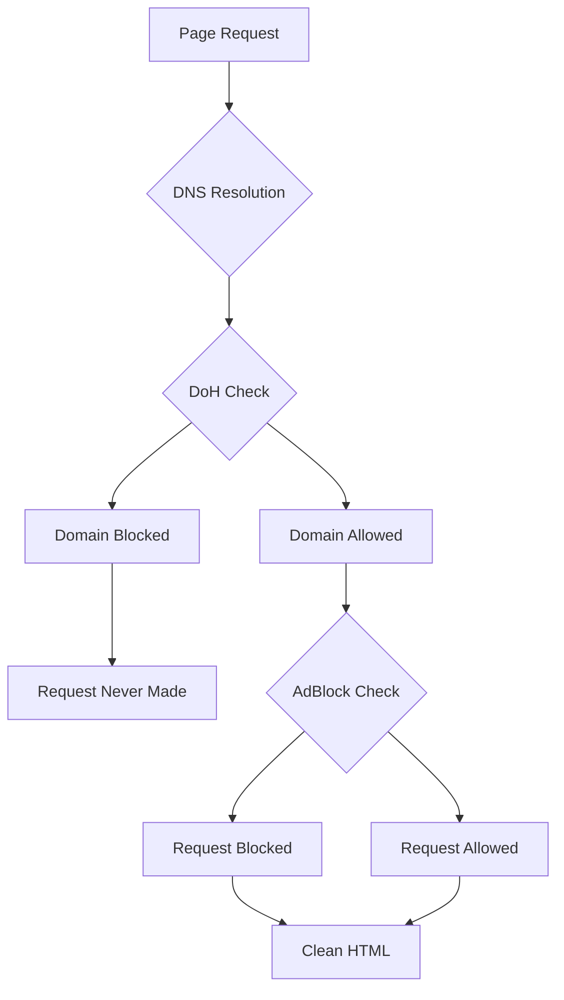

# 🛡️ AdBlock Protection for SSG

This document explains the AdBlock protection system built into the SSG tools, which prevents AdSense policy violations and ensures clean static HTML generation.

## 🚨 Why AdBlock is Critical

### AdSense Policy Violations

When generating static sites from live WordPress pages that include AdSense, you risk serious policy violations:

- **Automated Access**: Static generation involves automated page requests, which AdSense may flag as invalid traffic
- **Caching Violations**: AdSense prohibits caching of ads - static pages with embedded ad code violate this policy
- **Impression Manipulation**: Pre-rendered ads can't refresh properly, leading to invalid impression data
- **Account Suspension**: Policy violations can result in AdSense account suspension or permanent ban

### Invalid Traffic Patterns

**Google's Detection Systems** look for:

- Unusual request patterns from automated tools
- Pages that don't properly load ad scripts
- Traffic that doesn't match normal user behavior
- Cached or pre-rendered ad content

**The Risk**: Even well-intentioned static generation can trigger these detection systems.

## 🛡️ How SSG AdBlock Works

### Automatic Protection

The SSG tools include built-in request interception that automatically blocks:

1. **Ad Networks**

   - Google AdSense (`googlesyndication.com`)
   - DoubleClick (`doubleclick.net`)
   - Google Ad Services (`googleadservices.com`)
   - Amazon Ads (`amazon-adsystem.com`)
   - Media.net, Criteo, Outbrain, Taboola

2. **Tracking Scripts**

   - Facebook Pixel (`connect.facebook.net`)
   - User analytics (Hotjar, FullStory, Mouseflow)
   - Error tracking (Bugsnag, Sentry, Rollbar)
   - Session recording (Clarity, SmartLook)

3. **Analytics (Optional)**
   - Google Analytics (`google-analytics.com`)
   - Google Tag Manager (`googletagmanager.com`)
   - Custom analytics platforms

### Real-time Blocking

```typescript
// Example of blocked requests during generation (default settings)
🛡️ AdBlock enabled - blocking ads, tracking
🚫 Blocked script: googlesyndication.com/pagead/js/adsbygoogle.js (ad_blocking)
🚫 Blocked xhr: facebook.com/tr (tracking_blocking)
🚫 Blocked image: doubleclick.net/impression (ad_blocking)
🚫 Blocked 15 requests:
   - ad_blocking: 8
   - tracking_blocking: 7
✅ Static page generated: ./output/page.html
```

**Dynamic Messages Based on Configuration:**

```bash
# Default settings (SSG_BLOCK_ANALYTICS=false)
🛡️ AdBlock enabled - blocking ads, tracking

# With analytics blocking enabled (SSG_BLOCK_ANALYTICS=true)
🛡️ AdBlock enabled - blocking ads, tracking, analytics

# Minimal blocking (SSG_BLOCK_TRACKING=false)
🛡️ AdBlock enabled - blocking ads

# Ads only (SSG_BLOCK_TRACKING=false SSG_BLOCK_ANALYTICS=false)
🛡️ AdBlock enabled - blocking ads
```

## ⚙️ Configuration

### Environment Variables

```bash
# Core AdBlock Settings
SSG_BLOCK_ADS=true           # Block all ad networks (RECOMMENDED: true)
SSG_BLOCK_TRACKING=true      # Block tracking scripts (RECOMMENDED: true)
SSG_BLOCK_ANALYTICS=false    # Block analytics (RECOMMENDED: false)
SSG_LOG_BLOCKED=true         # Show blocking activity (RECOMMENDED: true)

# Advanced Configuration
SSG_ALLOWED_DOMAINS=cdn.example.com,trusted-service.com
SSG_CUSTOM_BLOCKLIST=unwanted-tracker.com,popup-service.js
```

### Recommended Settings

#### Production (AdSense Sites)

```bash
SSG_BLOCK_ADS=true          # CRITICAL: Prevents policy violations
SSG_BLOCK_TRACKING=true     # Recommended for privacy
SSG_BLOCK_ANALYTICS=true    # Recommended for bot-only serving
SSG_LOG_BLOCKED=false       # Reduce CI/CD noise
```

#### Development

```bash
SSG_BLOCK_ADS=true          # Always block ads
SSG_BLOCK_TRACKING=true     # Block tracking
SSG_BLOCK_ANALYTICS=false   # Keep analytics for testing
SSG_LOG_BLOCKED=true        # Show what's blocked
```

#### CI/CD

```bash
SSG_BLOCK_ADS=true          # Always block ads
SSG_BLOCK_TRACKING=true     # Block tracking
SSG_BLOCK_ANALYTICS=true    # Block analytics for bot-only content
SSG_LOG_BLOCKED=false       # Reduce log noise
```

## 🔧 Programmatic Usage

### Basic Usage

```typescript
import { generateStaticPage } from "./utilities/browser-utils.js";

// AdBlock is enabled by default with environment settings
await generateStaticPage("https://example.com", "./output/page.html");
```

### Custom Configuration

```typescript
import { generateStaticPage } from "./utilities/browser-utils.js";

// Override AdBlock settings for specific pages
await generateStaticPage("https://example.com", "./output/page.html", {
  minifyHtml: true,
  adBlock: {
    blockAds: true,
    blockTracking: true,
    blockAnalytics: false,
    logBlocked: true,
    allowedDomains: ["your-trusted-cdn.com"],
    customBlockList: ["unwanted-service.com"],
  },
});
```

### Advanced Usage

```typescript
import { AdBlockManager } from "./utilities/adblock-utils.js";
import { chromium } from "playwright";

// Manual AdBlock setup
const browser = await chromium.launch();
const page = await browser.newPage();

const adBlockManager = new AdBlockManager({
  blockAds: true,
  blockTracking: true,
  blockAnalytics: false,
  logBlocked: true,
});

await adBlockManager.setupPageInterception(page);
await page.goto("https://example.com");

// Get blocking statistics
const stats = adBlockManager.getBlockingStats();
console.log(`Blocked ${stats.totalBlocked} requests`);
```

## 📊 Blocked Domains & Patterns

### Ad Networks

- `googlesyndication.com` - Google AdSense
- `doubleclick.net` - DoubleClick ads
- `googleadservices.com` - Google Ads
- `amazon-adsystem.com` - Amazon advertising
- `media.net` - Media.net ads
- `criteo.com` - Criteo retargeting
- `outbrain.com` - Outbrain content
- `taboola.com` - Taboola recommendations

### Social Media Ads

- `facebook.com/tr` - Facebook Pixel
- `connect.facebook.net` - Facebook SDK
- `ads.twitter.com` - Twitter Ads
- `ads.linkedin.com` - LinkedIn Ads
- `ads.pinterest.com` - Pinterest Ads

### Tracking & Analytics

- `hotjar.com` - User session recording
- `fullstory.com` - Session replay
- `mouseflow.com` - Mouse tracking
- `crazyegg.com` - Heatmap tracking
- `clarity.ms` - Microsoft Clarity
- `bugsnag.com` - Error tracking
- `sentry.io` - Error monitoring

### URL Patterns

- `/ads/` - General ad paths
- `/adsense/` - AdSense specific
- `/pagead/` - Google page ads
- `/track` - Tracking endpoints
- `/pixel` - Tracking pixels
- `/beacon` - Analytics beacons
- `/collect` - Data collection

## 🔍 Troubleshooting

### Common Issues

#### 1. "Site functionality broken after generation"

**Problem**: Essential scripts are being blocked

**Solution**: Add to allowed domains

```bash
SSG_ALLOWED_DOMAINS=your-cdn.com,essential-service.com
```

#### 2. "AdSense still appears in static pages"

**Problem**: AdBlock not properly configured

**Solutions**:

- Verify `SSG_BLOCK_ADS=true`
- Check for custom ad implementations
- Review allowedDomains settings

#### 3. "Analytics not working on static site"

**Problem**: Analytics scripts being blocked

**Solution**: Keep analytics enabled

```bash
SSG_BLOCK_ANALYTICS=false
```

#### 4. "Too many requests being blocked"

**Problem**: Overly aggressive blocking

**Solutions**:

- Reduce blocking scope
- Add essential domains to allowlist
- Review custom blocklist

### Debugging

#### Enable Verbose Logging

```bash
SSG_LOG_BLOCKED=true bun run ssg https://example.com
```

#### Check Blocking Statistics

```typescript
// In your code
const stats = adBlockManager.getBlockingStats();
console.log("Blocking Summary:", {
  total: stats.totalBlocked,
  byReason: stats.byReason,
  byType: stats.byType,
});
```

#### Test Without AdBlock

```bash
SSG_BLOCK_ADS=false SSG_BLOCK_TRACKING=false bun run ssg https://example.com
```

## 🎯 Best Practices

### For AdSense Sites

1. **Always Block Ads**: Set `SSG_BLOCK_ADS=true` (critical)
2. **Block Tracking**: Set `SSG_BLOCK_TRACKING=true` (recommended)
3. **Block Analytics**: Set `SSG_BLOCK_ANALYTICS=true` (recommended for bot-only serving)
4. **Monitor Logs**: Enable logging during development
5. **Test Thoroughly**: Verify static pages don't contain ad code

### For High-Traffic Sites

1. **Optimize Blocking**: Disable logging in production (`SSG_LOG_BLOCKED=false`)
2. **Whitelist CDNs**: Add essential domains to allowlist
3. **Custom Blocklist**: Block specific unwanted services
4. **Monitor Performance**: Check if blocking affects generation speed

### For Development

1. **Enable Logging**: Always log blocked requests
2. **Test Different Settings**: Experiment with blocking levels
3. **Verify Output**: Check generated HTML for unwanted scripts
4. **Document Dependencies**: Note any essential external services

## 🔒 Security Considerations

### Policy Compliance

- **AdSense**: AdBlock prevents policy violations that could suspend accounts
- **Privacy**: Blocking tracking protects user privacy during generation
- **GDPR**: Reduces data collection concerns for EU users
- **Clean HTML**: Ensures static pages don't contain unwanted scripts

### Performance Benefits

- **Faster Generation**: Fewer external requests speed up page loading
- **Reduced Bandwidth**: Less data transfer during generation
- **Stable Output**: Eliminates dependency on external ad services
- **Predictable Results**: Consistent generation without external variables

### Limitations

- **Site Functionality**: Some features may depend on blocked scripts
- **Analytics**: Blocking analytics affects data collection
- **Dynamic Content**: Ad-supported features won't work in static version
- **Testing**: Static pages may not reflect live site behavior exactly

## � DNS over HTTPS (DoH) Integration

### DoH as Additional Protection Layer

The SSG tools include **DNS over HTTPS (DoH)** support as a complementary protection mechanism. DoH works at the DNS level to block ad and tracker domains before HTTP requests are even made.

### How DoH Enhances AdBlock



### DoH vs AdBlock Comparison

| Protection Layer | DoH (DNS Level) | AdBlock (Request Level) |
| ---------------- | --------------- | ----------------------- |
| **When it blocks** | Before DNS lookup | After DNS lookup |
| **What it blocks** | Domain names | Request URLs |
| **Performance impact** | Minimal latency | No additional latency |
| **Fallback behavior** | Falls back to regular DNS | No fallback needed |
| **Coverage** | All requests to domain | Specific request patterns |

### Combined Protection Benefits

- **Double Protection**: DoH blocks at DNS level, AdBlock at request level
- **Comprehensive Coverage**: Catches requests that AdBlock might miss
- **Enhanced Privacy**: DNS queries are encrypted with DoH
- **Better Performance**: Fewer DNS lookups for blocked domains

### Configuration for Maximum Protection

```bash
# Enable both DoH and AdBlock for comprehensive protection
SSG_DOH_SERVER=https://dns.adguard.com/dns-query
SSG_BLOCK_ADS=true
SSG_BLOCK_TRACKING=true
SSG_BLOCK_ANALYTICS=true
SSG_LOG_BLOCKED=true
```

### Example Output with Both Protections

```bash
# With DoH + AdBlock enabled
🔒 DNS over HTTPS enabled: https://dns.adguard.com/dns-query
🛡️ AdBlock enabled - blocking ads, tracking, analytics
🚫 Blocked script: googlesyndication.com/pagead/js/adsbygoogle.js (ad_blocking)
🚫 Blocked xhr: facebook.com/tr (tracking_blocking)
🚫 Blocked DNS: doubleclick.net (DoH blocking)
✅ Static page generated: ./output/page.html
```

## �📚 Related Documentation

- [SSG Tools Overview](README.md)
- [WordPress Integration](SSG-WP-INTEGRATION.md)
- [Environment Configuration](README.md#environment-variables)
- [Troubleshooting Guide](README.md#troubleshooting)

## 💡 Tips

1. **Start Conservative**: Begin with default settings and adjust as needed
2. **Test Thoroughly**: Always verify static pages work as expected
3. **Monitor Policies**: Stay updated on AdSense and analytics platform policies
4. **Document Changes**: Keep track of custom blocking rules
5. **Regular Review**: Periodically review and update blocking configuration
