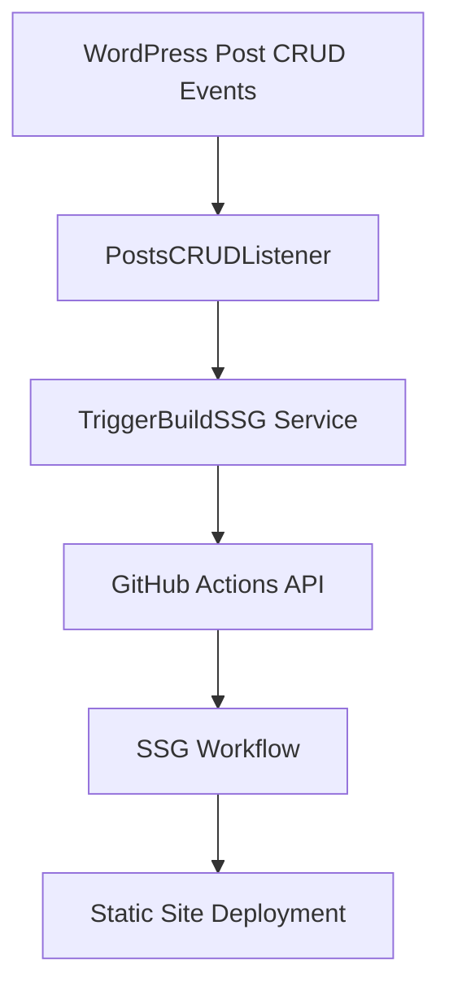

# 🏗️ SSG Tools Documentation

> 🚀 \*\*Static Site Generator Tools for WordPress Them## 🔗 Wo## 🔗 WordPress Integration & Automation (Selective Generation Only)

The WordPress integration automatically triggers **selective SSG builds** when content changes (e.g., when you update a post, it regenerates only that post's page, the homepage, and related archive pages)

[](https://img.shields.io/badge/TypeScript-007ACC?style=flat-square&logo=typescript&logoColor=white)


A comprehensive suite of static site generation tools designed for WordPress theme development, featuring advanced concurrency control, HTML minification, and robust error handling.

## ✨ Key Features

- 🔄 **Automated Builds** - Triggers on WordPress content changes
- ⚡ **High Performance** - Concurrent page generation with rate limiting
- 🗜️ **HTML Minification** - Optimized output for better performance
- 🛡️ **AdBlock Protection** - Blocks ads, tracking, and analytics during generation
  - 🔒 **DNS over HTTPS (DoH)** - Enhanced privacy with AdGuard DNS blocking
- 📊 **Performance Optimization** - Configurable settings to optimize generation speed
- 🛡️ **Error Handling** - Robust error handling and recovery mechanisms

## 📁 Project Structure

```text
tools/SSG/
├── ssg.ts                     # Single page generator
├── ssg-sitemap.ts             # Sitemap-based generator
├── docs/                      # Documentation files
│   ├── README.md              # This comprehensive documentation
│   ├── SSG-QUICKSTART.md      # Quick start guide (5 minutes)
│   ├── SSG-WP-INTEGRATION.md  # WordPress integration guide
│   ├── ADBLOCK-PROTECTION.md  # AdBlock protection guide
│   └── Personal-Note.md       # Personal notes
└── utilities/                 # Shared utility modules
    ├── adblock-utils.ts       # AdBlock & tracking protection
    ├── browser-utils.ts       # Browser automation utilities
    ├── concurrency-utils.ts   # Concurrency control
    ├── env-loader.ts          # Environment variable loading
    ├── file-utils.ts          # File operations
    └── xml-utils.ts           # XML parsing utilities

../server/                        # WordPress Backend Integration
├── Controllers/REST/
│   └── DispatchSSGBuild.php   # REST API for manual triggers
├── Services/PostsManagement/SSG/
│   ├── PostsCRUDListener.php   # WordPress post event listeners
│   ├── RedirectToSSG.php       # SSG page redirects
│   └── TriggerBuildSSG.php        # GitHub Actions API integration
└── Services/Utilities/SSG/
    ├── SSGUtilities.php        # WordPress SSG utilities
    └── URLFilterService.php    # URL processing for SSG
```

## 📚 Documentation

- **[SSG-QUICKSTART.md](./SSG-QUICKSTART.md)** - Get started in 5 minutes
- **[WordPress Integration](./SSG-WP-INTEGRATION.md)** - WordPress automation architecture
- **[AdBlock Protection](./ADBLOCK-PROTECTION.md)** - Comprehensive guide to ad blocking features
- **[README.md](./README.md)** - This comprehensive documentation

### Quick Navigation

- [⚡ GitHub Actions](#-github-actions-integration) - CI/CD workflow automation
- [🌐 REST API](#-rest-api-endpoints) - Manual trigger endpoints
- [⚙️ Configuration](SSG-WP-INTEGRATION.md) - WordPress setup and environment variables

## 🚀 Quick Start

### Prerequisites

- **Node.js 18+** or **Bun**
- **Playwright** (automatically installed)
- **WordPress site** with sitemap enabled

### Installation

```bash
# Navigate to theme directory
cd wordpress/wp-content/themes/wplokerbjm

# Install dependencies (if using npm/yarn)
npm install
# OR using bun
bun install

# Install Playwright browsers
npx playwright install # npm
bunx playwright install # bun
```

## 🛠️ SSG Tools

### 1. Single Page Generator (`ssg.ts`)

Generate static HTML from a single URL with optional minification.

#### Basic Usage

```bash
# Generate a single page
bun run ssg https://example.com/page ./output/page.html

# With HTML minification (set in .env file or environment)
SSG_MINIFY_HTML=true bun run ssg https://example.com/page ./output/page.html
```

#### Command Line Options

```text
Usage: bun tools/SSG/ssg.ts [url] [outputPath]

Arguments:
  url         URL to generate static page from
  outputPath  Output file path (default: ./assets/ssg/index.html)

Environment Variables (loaded from .env files):
  SSG_MINIFY_HTML    Minify HTML output (default: false)
  SSG_PAGE_TIMEOUT   Page generation timeout in ms (default: 30000)
  SSG_BLOCK_ADS      Block ads during generation (default: true)
  SSG_BLOCK_TRACKING Block tracking scripts (default: true)
  SSG_BLOCK_ANALYTICS Block analytics scripts (default: false)
  SSG_LOG_BLOCKED    Log blocked requests (default: true)
```

### 2. Sitemap-based Generator (`ssg-sitemap.ts`)

Generate static sites from XML sitemaps with advanced concurrency control.

#### Sitemap Generator Usage

```bash
# Generate from sitemap
bun run ssg:sitemap https://example.com/sitemap.xml

# With custom output directory
bun run ssg:sitemap https://example.com/sitemap.xml ./static-site
```

#### Advanced Sitemap Usage

```bash
# High concurrency for fast generation
SSG_CONCURRENCY=10 SSG_MINIFY_HTML=true bun run ssg:sitemap https://example.com/sitemap.xml

# Production settings with error tolerance
SSG_CONCURRENCY=5 SSG_CONTINUE_ON_ERROR=true SSG_MINIFY_HTML=true bun run ssg:sitemap https://example.com/sitemap.xml ./dist
```

#### Sitemap Generator Options

```text
Usage: bun tools/SSG/ssg-sitemap.ts <sitemapPathOrUrl> [outputDir]

Arguments:
  sitemapPathOrUrl  Path to local sitemap XML file or URL to remote sitemap
  outputDir         Output directory for static files (default: ./assets/ssg)

Environment Variables (loaded from .env files):
  SSG_CONCURRENCY         Number of concurrent page generations (default: 5)
  SSG_MAX_RETRIES         Maximum retry attempts for failed pages (default: 3)
  SSG_PAGE_TIMEOUT        Timeout for individual page generation in ms (default: 30000)
  SSG_CONTINUE_ON_ERROR   Continue processing even if some pages fail (default: false)
  SSG_MINIFY_HTML         Minify HTML output to reduce file size (default: false)
  SSG_BLOCK_ADS           Block ads during generation (default: true)
  SSG_BLOCK_TRACKING      Block tracking scripts (default: true)
  SSG_BLOCK_ANALYTICS     Block analytics scripts (default: false)
  SSG_LOG_BLOCKED         Log blocked requests (default: true)
```

### 3. Environment Configuration

Configure SSG tools using environment variables for optimal performance.

```bash
# Test different concurrency levels manually
SSG_CONCURRENCY=8 SSG_MINIFY_HTML=true bun run ssg:sitemap https://example.com/sitemap.xml

# Production settings with error tolerance
SSG_CONCURRENCY=5 SSG_CONTINUE_ON_ERROR=true SSG_MINIFY_HTML=true bun run ssg:sitemap https://example.com/sitemap.xml ./dist
```

## � WordPress Integration & Automation

This documentation has moved to a dedicated file: `SSG-WP-INTEGRATION.md`.

For full WordPress integration details (architecture, triggers, code examples, GitHub Actions setup, and automatic triggers), see:

`tools/SSG-WP-INTEGRATION.md`

The separate file contains configuration snippets for `wp-config.php`, GitHub Actions secrets, trigger examples, and automatic trigger strategies.
Automatically trigger SSG builds when WordPress content changes, providing seamless static site generation with dynamic content management.

### Architecture Overview



### Core Components

#### 1. WordPress Event Listeners (Selective Generation)

- [**PostsCRUDListener**](../../../server/Services/PostsManagement/SSG/PostsCRUDListener.php): Monitors post create/update/delete events for selective rebuilds
- **TaxonomyListener**: Monitors taxonomy changes (future enhancement)
- **UserListener**: Monitors user profile changes (future enhancement)

#### 2. Dispatcher Services (Selective Generation)

- [**TriggerBuildSSG**](../../../../../../../.github/workflows/ssg.yml): Core service for calling selective GitHub Actions workflow (`ssg.yml`)
- **PathResolver**: Determines which specific URLs need regeneration
- **QueueManager**: Handles batching and rate limiting (future enhancement)

**Note**: Full sitemap generation [`ssg-sitemap.yml`](../../../../../../../.github/workflows/ssg.yml) is triggered manually via GitHub Actions workflow dispatch button only.

### Data Flow

#### 1. Content Change Detection

```php
// WordPress fires save_post action
add_action('save_post', [PostsCRUDListener::class, 'onSavePost']);

// Listener collects affected URLs
$paths = [
    home_url('/'),                          // Homepage
    get_permalink($post_id),                // Post URL
    get_post_type_archive_link('lowongan'), // Archive page
];
```

#### 2. GitHub Actions Trigger

```php
// TriggerBuildSSG service calls GitHub API
$response = wp_remote_post("https://api.github.com/repos/{$owner}/{$repo}/actions/workflows/{$workflow}/dispatches", [
    'headers' => [
        'Authorization' => 'token ' . SSG_GITHUB_TOKEN,
        'Content-Type' => 'application/json',
    ],
    'body' => json_encode([
        'ref' => SSG_GITHUB_REF,
        'inputs' => [
            'paths' => json_encode($normalized_urls),
            'reason' => $reason,
        ],
    ]),
]);
```

#### 3. Dynamic URL Resolution

**Smart URL Detection**: PHP automatically determines your site URL using WordPress functions

```php
// Converts relative paths to complete URLs
$normalized = array_map(function ($path) {
    if (filter_var($path, FILTER_VALIDATE_URL)) {
        return $path; // Already full URL
    }
    return home_url($path); // Convert relative to full URL
}, $paths);
```

**Benefits:**

- **Environment Agnostic**: Works with staging, production, or any domain
- **No Configuration**: WordPress determines site URL automatically
- **Privacy Protection**: Logs show only path slugs for security

### Automatic Triggers

#### Post Events

- **Post Created/Updated**: Triggers build for post permalink + homepage
- **Post Deleted/Trashed**: Triggers build for affected paths
- **Selective Builds**: Only regenerates changed pages for efficiency

#### Workflow Strategies

##### Selective Generation (`ssg.yml`) - WordPress Integrated

- **Use Case**: Regenerate only specific pages when content changes
- **Trigger**:
  - ✅ **Automatic**: WordPress post updates (via PostsCRUDListener)
  - ✅ **Manual**: REST API with specific paths
- **Best For**: Production sites with frequent content updates
- **Integration**: Full WordPress integration with automatic triggers

##### Full Sitemap Generation (`ssg-sitemap.yml`) - Manual Only

- **Use Case**: Regenerate entire site from sitemap
- **Trigger**:
  - ❌ **Automatic**: Not integrated with WordPress
  - ✅ **Manual**: GitHub Actions workflow dispatch button only
- **Best For**: Full site rebuilds, staging deployments, complete regeneration
- **Requires**: `SITE_URL` secret in GitHub repository settings
- **Note**: No WordPress integration - purely manual workflow

---

## ⚡ GitHub Actions Integration

Seamless integration with GitHub Actions workflows for automated static site generation and deployment.

### Required Workflow Configuration

#### Selective Generation Workflow

[ssg.yml](../../../../../../../.github/workflows/ssg.yml)

#### Full Sitemap Workflow

[ssg-sitemap.yml](../../../../../../../.github/workflows/ssg-sitemap.yml)

### Workflow Inputs

#### Selective Workflow Receives

```json
{
  "paths": ["/lowongan/job-slug", "/"],
  "reason": "post_updated"
}
```

#### Sitemap Workflow Uses

- Automatically fetches and processes `${SITE_URL}/sitemap_index.xml`
- Regenerates all pages found in the sitemap
- Ideal for full site rebuilds

---

## 🌐 REST API Endpoints

Manual trigger endpoints for testing and administrative control over SSG builds.

### Dispatch SSG Build Endpoint

**Endpoint**: `/wp-json/wplokerbjm/v1/dispatch-ssg/`  
**Method**: `POST`  
**Authentication**: WordPress admin authentication required  
**Capability**: `manage_options`

#### Request Format

```json
{
  "paths": ["/", "/lowongan/sample-job", "/about"],
  "reason": "manual_test"
}
```

#### cURL Example

```bash
# Test the SSG trigger endpoint with specific paths
curl -X POST https://yoursite.com/wp-json/wplokerbjm/v1/dispatch-ssg/ \
  -H "Content-Type: application/json" \
  -u "admin_username:password" \
  --data '{
    "paths": ["/", "/lowongan/sample-job"],
    "reason": "manual_test"
  }'
```

#### Response Format

**Success Response:**

```json
{
  "success": true,
  "message": "SSG build triggered successfully",
  "data": {
    "workflow": "ssg.yml",
    "paths_count": 2,
    "reason": "manual_test",
    "github_response": {
      "status": 204
    }
  }
}
```

**Error Response:**

```json
{
  "success": false,
  "message": "GitHub Actions API error",
  "data": {
    "error": "Non-2xx response: 404",
    "workflow": "ssg.yml"
  }
}
```

#### Path Processing

- **Accepts**: Both relative paths (`/about`) and absolute URLs (`https://example.com/about`)
- **Normalizes**: All paths to full URLs using `home_url()`
- **Deduplicates**: Removes duplicate URLs
- **Validates**: Ensures paths are properly formatted

#### Security Features

- **Authentication Required**: Must be logged in as WordPress admin
- **Permission Check**: Requires `manage_options` capability
- **Input Validation**: Sanitizes all input parameters
- **Rate Limiting**: Prevents API abuse (configurable)
- **Audit Logging**: Logs all API calls for security monitoring

### API Status Endpoint

**Endpoint**: `/wp-json/wplokerbjm/v1/`  
**Method**: `GET`  
**Authentication**: None required

```bash
# Check if endpoints are registered
curl https://yoursite.com/wp-json/wplokerbjm/v1/
```

---

## ⚙️ Environment Variables

| Variable                | Default | Description                                 | Applies To  |
| ----------------------- | ------- | ------------------------------------------- | ----------- |
| `SSG_CONCURRENCY`       | `5`     | Number of concurrent page generations       | ssg-sitemap |
| `SSG_MAX_RETRIES`       | `3`     | Maximum retry attempts for failed pages     | All tools   |
| `SSG_PAGE_TIMEOUT`      | `30000` | Page generation timeout in ms               | All tools   |
| `SSG_CONTINUE_ON_ERROR` | `false` | Continue processing even if some pages fail | ssg-sitemap |
| `SSG_MINIFY_HTML`       | `false` | Minify HTML output to reduce file size      | All tools   |
| `SSG_BLOCK_ADS`         | `true`  | Block ads during generation (AdSense safe)  | All tools   |
| `SSG_BLOCK_TRACKING`    | `true`  | Block tracking scripts during generation    | All tools   |
| `SSG_BLOCK_ANALYTICS`   | `false` | Block analytics during generation           | All tools   |
| `SSG_LOG_BLOCKED`       | `true`  | Log blocked requests for debugging          | All tools   |
| `SSG_DOH_SERVER`        | `https://dns.adguard.com/dns-query` | DNS over HTTPS server for enhanced privacy | All tools   |

### Vite Environment Loading

The SSG tools leverage **Vite's environment loading system** using a custom `env-loader` utility that wraps Vite's `loadEnv` function. This provides several advantages:

#### Automatic .env File Loading

The env-loader automatically loads environment variables from `.env` files in this priority order:

1. **`.env.local`** (highest priority - gitignored)
2. **`.env.{mode}.local`** (e.g., `.env.production.local`)
3. **`.env.{mode}`** (e.g., `.env.production`)
4. **`.env`** (lowest priority)

#### Environment-Specific Configurations

You can have different settings for different environments:

```bash
# .env (base configuration)
SSG_MINIFY_HTML=true
SSG_PAGE_TIMEOUT=30000

# .env.production (production overrides)
SSG_CONCURRENCY=8
SSG_CONTINUE_ON_ERROR=true

# .env.development (development overrides)
SSG_CONCURRENCY=2
SSG_MINIFY_HTML=false
```

#### Setup Instructions

```bash
# 1. Copy the example environment file
cp .ssg.env.example .env

# 2. Edit your configuration
nano .env

# 3. Run SSG tools (they'll automatically load your .env file)
bun run ssg https://example.com
bun run ssg:sitemap https://example.com/sitemap.xml
```

This approach eliminates the need to manually set environment variables each time and provides a clean, version-controlled configuration system.

## 🛡️ AdBlock Protection

### Why AdBlock is Important for SSG

When generating static sites from live WordPress pages that include AdSense, Google Analytics, or other tracking scripts, you risk violating platform Terms of Service and creating invalid traffic patterns. The SSG tools include comprehensive adblock protection to ensure clean, policy-compliant static pages.

### AdSense Policy Compliance

**The Problem**: Static site generation can trigger AdSense policy violations because:

- Automated page access may be flagged as invalid traffic
- Cached ad content violates AdSense caching policies
- Pre-rendered ads don't refresh properly, causing impression discrepancies

**The Solution**: SSG AdBlock automatically blocks:

- **Google AdSense**: All googlesyndication.com, doubleclick.net, googleadservices.com
- **Ad Networks**: Amazon Ads, Media.net, Criteo, Outbrain, Taboola
- **Social Media Ads**: Facebook Ads, Twitter Ads, LinkedIn Ads, Pinterest Ads

### Tracking Protection

**Blocked Tracking Services**:

- **Facebook Pixel**: connect.facebook.net, facebook.com/tr
- **User Analytics**: Hotjar, FullStory, Mouseflow, CrazyEgg
- **Error Tracking**: Bugsnag, Sentry, Rollbar, TrackJS
- **Session Recording**: Clarity, SmartLook, LogRocket

### Analytics Handling

**Google Analytics & GTM**: Blocked optionally (default: `false`)

- Keep analytics enabled to preserve site functionality
- Analytics don't violate policies like ads do
- Helps maintain proper site understanding during generation

### Configuration Options

```bash
# AdBlock Environment Variables
SSG_BLOCK_ADS=true           # Block all ad networks (recommended: true)
SSG_BLOCK_TRACKING=true      # Block user tracking (recommended: true)
SSG_BLOCK_ANALYTICS=false    # Block analytics (recommended: false)
SSG_LOG_BLOCKED=true         # Show blocking activity (recommended: true)

# Advanced Configuration
SSG_ALLOWED_DOMAINS=your-cdn.com,trusted-service.com
SSG_CUSTOM_BLOCKLIST=unwanted-tracker.com,popup-service.js
```

### AdBlock in Action

```bash
# Example output with AdBlock enabled (production settings for bot-only serving)
🛡️ AdBlock enabled - blocking ads, tracking, analytics
🚫 Blocked script: googlesyndication.com/pagead/js/adsbygoogle.js (ad_blocking)
🚫 Blocked xhr: facebook.com/tr (tracking_blocking)
🚫 Blocked fetch: google-analytics.com/g/collect (analytics_blocking)
🚫 Blocked 15 requests:
   - ad_blocking: 8
   - tracking_blocking: 5
   - analytics_blocking: 2
✅ Static page generated: ./output/page.html
```

**Dynamic Messages Based on Configuration:**

```bash
# Production settings (bot-only serving)
🛡️ AdBlock enabled - blocking ads, tracking, analytics

# Development settings (analytics allowed)
🛡️ AdBlock enabled - blocking ads, tracking

# Minimal blocking (SSG_BLOCK_TRACKING=false)
🛡️ AdBlock enabled - blocking ads

# Ads only (SSG_BLOCK_TRACKING=false SSG_BLOCK_ANALYTICS=false)
🛡️ AdBlock enabled - blocking ads
```

### Using AdBlock Programmatically

```typescript
import { generateStaticPage } from "./utilities/browser-utils.js";

// Generate with custom AdBlock configuration
await generateStaticPage("https://example.com", "./output/page.html", {
  minifyHtml: true,
  adBlock: {
    blockAds: true,
    blockTracking: true,
    blockAnalytics: false,
    logBlocked: true,
    allowedDomains: ["your-trusted-cdn.com"],
    customBlockList: ["unwanted-service.com"],
  },
});
```

### Security Benefits

- **Policy Compliance**: Prevents AdSense account suspension
- **Clean HTML**: Removes tracking pixels and ad placeholders
- **Performance**: Faster generation without external ad requests
- **Privacy**: No user data collection during generation
- **Reliability**: Eliminates external service dependencies

## � DNS over HTTPS (DoH) Protection

### What is DoH?

**DNS over HTTPS (DoH)** encrypts DNS queries and routes them through a privacy-focused DNS server. The SSG tools integrate DoH with AdGuard's DNS service to provide an additional layer of ad and tracker blocking at the DNS level.

### DoH Benefits

- **Enhanced Privacy**: DNS queries are encrypted and protected from eavesdropping
- **Additional Blocking**: Blocks ad/tracker domains before requests are made
- **Complementary Protection**: Works alongside request-level AdBlock for comprehensive protection
- **Performance**: Minimal latency impact with fallback to regular DNS if DoH fails

### DoH Configuration

```bash
# DoH Environment Variables
SSG_DOH_SERVER=https://dns.adguard.com/dns-query    # AdGuard (blocks ads/malware/tracking)
# Alternative: https://p2.freedns.controld.com/freedns-query (family protection)
```

### DoH in Action

```bash
# Example output with DoH enabled
🔒 DNS over HTTPS enabled: https://dns.adguard.com/dns-query
🛡️ AdBlock enabled - blocking ads, tracking
🚫 Blocked script: googlesyndication.com/pagead/js/adsbygoogle.js (ad_blocking)
🚫 Blocked xhr: facebook.com/tr (tracking_blocking)
✅ Static page generated: ./output/page.html
```

### DoH vs AdBlock

| Feature | AdBlock (Request Level) | DoH (DNS Level) |
| ------- | ----------------------- | --------------- |
| **Scope** | Blocks HTTP requests | Blocks DNS resolution |
| **Timing** | After DNS lookup | Before request |
| **Coverage** | Request URLs | Domain names |
| **Fallback** | N/A | Regular DNS |
| **Performance** | Minimal impact | Small latency increase |

### Recommended DoH Settings

#### Production (Maximum Privacy)

```bash
SSG_DOH_SERVER=https://dns.adguard.com/dns-query
SSG_BLOCK_ADS=true
SSG_BLOCK_TRACKING=true
SSG_BLOCK_ANALYTICS=true
```

#### Development (Balanced)

```bash
SSG_DOH_SERVER=https://dns.adguard.com/dns-query
SSG_BLOCK_ADS=true
SSG_BLOCK_TRACKING=true
SSG_BLOCK_ANALYTICS=false
```

#### CI/CD (Automated)

```bash
SSG_DOH_SERVER=https://dns.adguard.com/dns-query
SSG_BLOCK_ADS=true
SSG_BLOCK_TRACKING=true
SSG_BLOCK_ANALYTICS=true
SSG_LOG_BLOCKED=false
```

## �📊 Performance Optimization

### Concurrency Tuning

```bash
# Test different concurrency levels
for i in {1..10}; do
  echo "Testing concurrency: $i"
  SSG_CONCURRENCY=$i timeout 60 bun run ssg:sitemap https://example.com/sitemap.xml ./test-$i
done
```

### Recommended Settings

| Use Case    | Concurrency | Minification | Continue on Error |
| ----------- | ----------- | ------------ | ----------------- |
| Development | 2-3         | false        | false             |
| Staging     | 5           | true         | false             |
| Production  | 5-8         | true         | true              |
| CI/CD       | 3           | true         | true              |

## 🏗️ Utility Modules

### Browser Utils (`browser-utils.ts`)

Advanced browser automation with retry logic and minification.

```typescript
import { generateStaticPage } from "./utilities/browser-utils.js";

// Generate page with options
await generateStaticPage("https://example.com", "./output/page.html", {
  minifyHtml: true,
  timeout: 45000,
});
```

### Concurrency Utils (`concurrency-utils.ts`)

Semaphore-based concurrency control for parallel processing.

```typescript
import { processWithConcurrency } from "./utilities/concurrency-utils.js";

const results = await processWithConcurrency(urls, processor, {
  concurrency: 5,
  continueOnError: true,
  onProgress: (completed, total, url) =>
    console.log(`${completed}/${total}: ${url}`),
});
```

### File Utils (`file-utils.ts`)

Safe file operations with automatic directory creation.

```typescript
import { FileManager } from "./utilities/file-utils.js";

// Safe file writing (creates directories automatically)
FileManager.writeFile("./deep/path/file.html", content);

// Get directory statistics
const stats = FileManager.getDirectoryStats("./output");
console.log(`Generated ${stats.htmlFileCount} pages, ${stats.formattedSize}`);
```

### XML Utils (`xml-utils.ts`)

XML parsing and sitemap processing utilities.

```typescript
import { SitemapParser } from "./utilities/xml-utils.js";

const parser = new SitemapParser();
const urls = await parser.parseSitemapUrl("https://example.com/sitemap.xml");
```

## 🔧 Configuration Examples

### Development Setup

```bash
# .env file
SSG_CONCURRENCY=2
SSG_MINIFY_HTML=false
SSG_CONTINUE_ON_ERROR=false
```

### Production Setup

```bash
# Production environment
export SSG_CONCURRENCY=8
export SSG_MINIFY_HTML=true
export SSG_CONTINUE_ON_ERROR=true
export SSG_MAX_RETRIES=5
export SSG_PAGE_TIMEOUT=60000
```

### CI/CD Pipeline

```yaml
# .github/workflows/deploy.yml
- name: Generate Static Site
  run: |
    SSG_CONCURRENCY=3 SSG_MINIFY_HTML=true SSG_CONTINUE_ON_ERROR=true \
    bun run ssg:sitemap https://example.com/sitemap.xml ./static-site
```

## 📈 Performance Benchmarks

### Typical Results (434 pages)

| Concurrency | Time       | Pages/sec | Status     |
| ----------- | ---------- | --------- | ---------- |
| 1           | ~15-20 min | ~0.5      | Sequential |
| 3           | ~5-7 min   | ~1.7      | Good       |
| 5           | ~3-4 min   | ~2.2      | Optimal    |
| 10          | ~2-3 min   | ~3.0      | High       |

### File Size Reduction

- **Without minification**: 108,036 bytes
- **With minification**: 105,199 bytes
- **Reduction**: 2.6% (~2.8KB savings per page)

## 🐛 Troubleshooting

### SSG Tools Issues

#### 1. Playwright Browser Installation

```bash
# Install browsers
npx playwright install

# Install with dependencies
npx playwright install --with-deps
```

#### 2. Timeout Errors

```bash
# Increase timeout for slow pages
SSG_PAGE_TIMEOUT=60000 bun run ssg https://slow-site.com
```

#### 3. Memory Issues

```bash
# Reduce concurrency for memory-constrained environments
SSG_CONCURRENCY=2 bun run ssg:sitemap https://example.com/sitemap.xml
```

#### 4. Rate Limiting

```bash
# Add delays between requests (modify utilities if needed)
# Or reduce concurrency
SSG_CONCURRENCY=1 bun run ssg:sitemap https://example.com/sitemap.xml
```

### WordPress Integration Issues

#### 1. "Missing GitHub Actions configuration"

**Symptoms**: WordPress logs show configuration errors

**Solutions**:

- Check that all required constants are defined in `wp-config.php`
- Verify the GitHub token has `repo` permissions
- Ensure `SSG_GITHUB_TOKEN` is not empty or expired

```php
// Verify configuration in wp-config.php
define('SSG_GITHUB_TOKEN', 'ghp_your_actual_token_here');
define('SSG_GITHUB_OWNER', 'LNSR');
define('SSG_GITHUB_REPO', 'wplokerbjm');
define('SSG_GITHUB_WORKFLOW', 'ssg.yml');
```

#### 2. "Non-2xx response from GitHub Actions"

**Symptoms**: API calls fail with HTTP error codes

**Solutions**:

- **404 Error**: Check workflow filename matches `SSG_GITHUB_WORKFLOW`
- **401 Error**: Verify GitHub token permissions and validity
- **403 Error**: Check GitHub API rate limits
- **422 Error**: Verify workflow accepts `workflow_dispatch` trigger

```bash
# Test GitHub API access manually
curl -H "Authorization: token YOUR_TOKEN" \
  https://api.github.com/repos/[YOUR_GITHUB_USERNAME]/wplokerbjm/actions/workflows
```

#### 3. "Workflow triggered but no SSG files generated"

**Symptoms**: GitHub Actions shows success but no static files created

**Solutions**:

- Verify the workflow has access to SSG tools
- Check that `assets/ssg/` directory is writable
- Review workflow logs for Node.js/Bun errors
- Ensure Playwright browsers are installed in workflow

```yaml
# Add to workflow for debugging
- name: Debug SSG Tools
  run: |
    ls -la tools/SSG/
    bun --version
    npx playwright --version
```

#### 4. "Posts not triggering automatic builds"

**Symptoms**: Creating/updating posts doesn't trigger workflows

**Solutions**:

- Check if `SSG_TRIGGER_ENABLED` is set to `true`
- Verify WordPress hooks are properly registered
- Enable WordPress debug logging to see hook execution
- Check for PHP errors in WordPress error logs

```php
// Add to wp-config.php for debugging
define('WP_DEBUG', true);
define('WP_DEBUG_LOG', true);

// Check if listener is registered
add_action('init', function() {
    error_log('SSG hooks registered: ' . (has_action('save_post') ? 'yes' : 'no'));
});
```

#### 5. "Sitemap workflow fails"

**Symptoms**: Full sitemap generation fails

**Solutions**:

- Ensure `SITE_URL` secret is set in GitHub repository settings
- Verify sitemap is accessible at `${SITE_URL}/sitemap_index.xml`
- Check sitemap contains valid, accessible URLs
- Verify sitemap XML format is valid

```bash
# Test sitemap accessibility
curl -I https://your-site.com/sitemap_index.xml

# Validate sitemap XML
wget https://your-site.com/sitemap_index.xml
xmlstarlet validate sitemap_index.xml
```

#### 6. "REST API endpoint not accessible"

**Symptoms**: `/wp-json/wplokerbjm/v1/dispatch-ssg/` returns 404

**Solutions**:

- Check WordPress REST API is enabled
- Verify custom endpoint registration in WordPress
- Ensure pretty permalinks are enabled
- Check for plugin conflicts affecting REST API

```bash
# Test WordPress REST API
curl https://your-site.com/wp-json/wp/v2/

# Check if custom namespace is registered
curl https://your-site.com/wp-json/wplokerbjm/v1/
```

### Debug Mode

#### SSG Tools Debug

```bash
# Enable verbose logging
DEBUG=* bun run ssg:sitemap https://example.com/sitemap.xml
```

#### WordPress Debug

```php
// Add to wp-config.php
define('WP_DEBUG', true);
define('WP_DEBUG_LOG', true);
define('WP_DEBUG_DISPLAY', false);

// Check debug log
tail -f /path/to/wordpress/wp-content/debug.log
```

#### GitHub Actions Debug

```yaml
# Add to workflow for detailed logging
- name: Debug Environment
  run: |
    echo "Paths: ${{ github.event.inputs.paths }}"
    echo "Reason: ${{ github.event.inputs.reason }}"
    env | grep SSG_
    ls -la assets/ssg/ || echo "SSG directory not found"
```

### Performance Issues

#### WordPress Performance

- **API Timeouts**: Increase `SSG_TRIGGER_TIMEOUT` for slow connections
- **Memory Limits**: Ensure WordPress has sufficient memory for API calls
- **Rate Limiting**: Configure `SSG_TRIGGER_RATE_LIMIT` to prevent overwhelming GitHub API

#### GitHub Actions Performance

- **Workflow Concurrency**: Limit concurrent workflows to prevent resource exhaustion
- **SSG Concurrency**: Reduce `SSG_CONCURRENCY` if workflows fail due to memory limits
- **Timeout Settings**: Increase `SSG_PAGE_TIMEOUT` for slow pages

### Error Log Analysis

#### GitHub Actions Error Patterns

- **Browser crashes**: Reduce concurrency or increase memory
- **Network timeouts**: Check site accessibility and increase timeouts
- **Permission errors**: Verify SSH keys and deployment credentials

## 🔒 Security Considerations

- **User Agent**: Tools identify as bots to avoid rate limiting
- **Timeout Protection**: Prevents hanging on slow/unresponsive pages
- **Error Isolation**: Failed pages don't crash entire generation process
- **Resource Limits**: Configurable concurrency prevents resource exhaustion

## 📚 API Reference

### generateStaticPage(url, outputPath, options)

Generate a static page from URL.

**Parameters:**

- `url` (string): Source URL
- `outputPath` (string): Output file path
- `options` (object):
  - `minifyHtml` (boolean): Enable HTML minification
  - `timeout` (number): Page load timeout in ms

**Returns:** Promise&lt;void&gt;

### processWithConcurrency(items, processor, options)

Process items with controlled concurrency.

**Parameters:**

- `items` (string[]): Items to process
- `processor` (function): Function to process each item
- `options` (object):
  - `concurrency` (number): Max concurrent operations
  - `continueOnError` (boolean): Continue on errors
  - `onProgress` (function): Progress callback
  - `onError` (function): Error callback

**Returns:** Promise&lt;ConcurrencyResult&gt;

## 🆘 Support

### For SSG Tools Issues

1. Check this documentation
2. Review error messages
3. Test with minimal concurrency (1-2)
4. Check Playwright installation
5. Verify Node.js/Bun compatibility

### For WordPress Integration Issues

1. **Check Configuration**

   - Verify all required constants in `wp-config.php`
   - Test GitHub token permissions
   - Confirm workflow files exist

2. **Debug WordPress**

   - Enable WordPress debug logging
   - Check REST API accessibility
   - Verify hook registration

3. **Test GitHub Actions**

   - Manual workflow dispatch from GitHub
   - Check workflow logs for errors
   - Verify repository secrets configuration

4. **Validate Setup**
   - Test with manual REST API call
   - Verify sitemap accessibility
   - Check file permissions for SSG output directory
