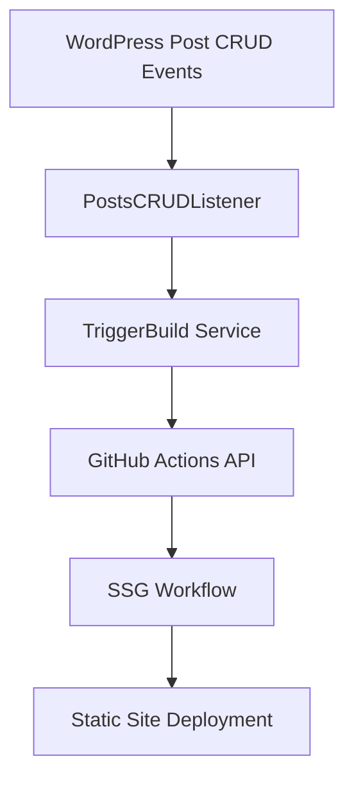

# ⚙️ WordPress Configuration (Selective Generation Only)

**Important**: This WordPress integration only handles **selective page generation** when content changes. It does not trigger full sitemap generation.

- ✅ **WordPress Integration**: Selective generation (specific pages when content changes)
- ❌ **WordPress Integration**: Full sitemap generation (manual GitHub Actions only)

Complete setup guide for WordPress integration with GitHub Actions automation for selective SSG builds.

## Required Constants

Add these constants to your `wp-config.php` file:

```php
// SSG GitHub Actions Configuration
define('SSG_GITHUB_TOKEN', 'ghp_your_token_here');        // GitHub Personal Access Token
define('SSG_GITHUB_OWNER', 'LNSR');                       // GitHub username/organization
define('SSG_GITHUB_REPO', 'wplokerbjm');                  // Repository name
define('SSG_GITHUB_WORKFLOW', 'ssg.yml');                 // Workflow filename
define('SSG_GITHUB_REF', 'main');                         // Branch to trigger builds on
```

## Optional Configuration

```php
// Advanced SSG Configuration
define('SSG_TRIGGER_ENABLED', true);          // Enable/disable automatic triggers
define('SSG_TRIGGER_TIMEOUT', 15);            // API timeout in seconds
define('SSG_TRIGGER_RETRIES', 3);             // Retry attempts for failed API calls
define('SSG_TRIGGER_BATCH_SIZE', 10);         // Max paths per trigger
define('SSG_TRIGGER_RATE_LIMIT', 60);         // Seconds between triggers
```

## Configuration Options Reference

| Constant                 | Default  | Required | Description                                          |
| ------------------------ | -------- | -------- | ---------------------------------------------------- |
| `SSG_GITHUB_TOKEN`       | -        | ✅       | GitHub Personal Access Token with `repo` permissions |
| `SSG_GITHUB_OWNER`       | -        | ✅       | GitHub username or organization name                 |
| `SSG_GITHUB_REPO`        | -        | ✅       | Repository name                                      |
| `SSG_GITHUB_WORKFLOW`    | -        | ✅       | Workflow filename (`ssg.yml` or `ssg-sitemap.yml`)   |
| `SSG_GITHUB_REF`         | `'main'` | ❌       | Branch to trigger builds on                          |
| `SSG_TRIGGER_ENABLED`    | `true`   | ❌       | Enable/disable automatic triggers                    |
| `SSG_TRIGGER_TIMEOUT`    | `15`     | ❌       | API timeout in seconds                               |
| `SSG_TRIGGER_RETRIES`    | `3`      | ❌       | Retry attempts for failed API calls                  |
| `SSG_TRIGGER_BATCH_SIZE` | `10`     | ❌       | Maximum paths per trigger                            |
| `SSG_TRIGGER_RATE_LIMIT` | `60`     | ❌       | Seconds between triggers                             |

## GitHub Personal Access Token Setup

1. **Navigate to GitHub Settings**

   - Go to GitHub → Settings → Developer settings → Personal access tokens
   - Click "Generate new token (classic)"

2. **Configure Token Permissions**

   - **Scopes required**: `repo` (Full control of private repositories)
   - **Expiration**: Set according to your security policy
   - **Note**: Add a descriptive note (e.g., "SSG WordPress Integration")

3. **Copy and Secure Token**
   - Copy the generated token immediately
   - Add it to your `wp-config.php` as `SSG_GITHUB_TOKEN`
   - Store securely - tokens cannot be viewed again

## GitHub Repository Secrets (For Sitemap Workflow)

If using the sitemap workflow (`ssg-sitemap.yml`), add these secrets to your GitHub repository:

1. **Navigate to Repository Settings**

   - Go to your GitHub repository → Settings → Secrets and variables → Actions

2. **Add Required Secrets**
   - `SITE_URL`: Your WordPress site URL (e.g., `https://example.com`)
   - `SSH_PRIVATE_KEY`: SSH private key for deployment
   - `SSH_USER`: SSH username for deployment
   - `HOST`: Deployment server hostname
   - `REMOTE_PATH`: Remote server path for deployment

## Debug Configuration

For troubleshooting, enable WordPress debug logging:

```php
// Debug Configuration
define('WP_DEBUG', true);
define('WP_DEBUG_LOG', true);
define('WP_DEBUG_DISPLAY', false);
```

## Architecture Overview



## Core Components (with implementation links)

This section maps the conceptual components to the actual PHP classes and files in this theme so you can jump straight to the implementation.

### 1. WordPress Event Listeners

- `PostsCRUDListener` — listens to post create/update/delete and enqueues or resolves affected URLs.
  - Implementation: `server/Services/PostsManagement/SSG/PostsCRUDListener.php`
  - Primary responsibility: inspect the saved/updated post, compute related paths (post permalink, homepage, archive pages) and forward them to the dispatcher.

### 2. Dispatcher Services

- `TriggerBuild` — orchestrates dispatching builds to GitHub Actions (selective or full-site). See `server/Services/PostsManagement/SSG/TriggerBuild.php`.
- `PathResolver` — helper that normalizes and deduplicates paths before dispatch (usually part of the services in `server/Services/Utilities/SSG/`).

### 3. Controllers / REST API

- `DispatchSSGBuild` — REST controller for manual SSG dispatches, validates input and permissions, filters paths, and calls `TriggerBuild`.
  - Implementation: `server/Controllers/REST/DispatchSSGBuild.php`
  - REST route registration: `server/Services/REST/RESTRoute.php` (registers the `/wplokerbjm/v1/dispatch-ssg/` endpoint and connects it to `DispatchSSGBuild::handle`).

### 4. Configuration & Utilities

- `URLFilterService` — filters and sanitizes URL lists before dispatch (used by `DispatchSSGBuild`): `server/Services/Utilities/SSG/URLFilterService.php`.

Quick navigation (click to open the files in your editor):

- `server/Services/PostsManagement/SSG/PostsCRUDListener.php` — post events → path collection
- `server/Services/PostsManagement/SSG/TriggerBuild.php` — triggers GitHub Actions dispatch
- `server/Controllers/REST/DispatchSSGBuild.php` — REST handler (permission/rate-limit/dry-run)
- `server/Services/REST/RESTRoute.php` — registers REST routes used by SSG tools
- `server/Services/Utilities/SSG/URLFilterService.php` — path filtering and normalization

If any of these files are missing in your local tree, they live under `server/Services/...` and are part of the SSG integration layer.

## Data Flow

### 1. Content Change Detection

```php
// WordPress fires save_post action
add_action('save_post', [PostsCRUDListener::class, 'onSavePost']);

// Listener collects affected URLs
$paths = [
   home_url('/'),                          // Homepage
   get_permalink($post_id),                // Post URL
   get_post_type_archive_link('lowongan'), // Archive page
];
```

### 2. GitHub Actions Trigger

```php
// TriggerBuild service calls GitHub API
$response = wp_remote_post("https://api.github.com/repos/{$owner}/{$repo}/actions/workflows/{$workflow}/dispatches", [
   'headers' => [
      'Authorization' => 'token ' . SSG_GITHUB_TOKEN,
      'Content-Type' => 'application/json',
   ],
   'body' => json_encode([
      'ref' => SSG_GITHUB_REF,
      'inputs' => [
         'paths' => json_encode($normalized_urls),
         'reason' => $reason,
      ],
   ]),
]);
```

### 3. Dynamic URL Resolution

**Smart URL Detection**: PHP automatically determines your site URL using WordPress functions

```php
// Converts relative paths to complete URLs
$normalized = array_map(function ($path) {
   if (filter_var($path, FILTER_VALIDATE_URL)) {
      return $path; // Already full URL
   }
   return home_url($path); // Convert relative to full URL
}, $paths);
```

**Benefits:**

- **Environment Agnostic**: Works with staging, production, or any domain
- **No Configuration**: WordPress determines site URL automatically
- **Privacy Protection**: Logs show only path slugs for security

## Automatic Triggers

### Post Events

- **Post Created/Updated**: Triggers build for post permalink + homepage
- **Post Deleted/Trashed**: Triggers build for affected paths
- **Selective Builds**: Only regenerates changed pages for efficiency

## Supported Workflow Strategies

### Option A: Selective Generation (`ssg.yml`)

- **Use Case**: Regenerate only specific pages when content changes
- **Trigger**: Automatic on post updates, manual with specific paths
- **Best For**: Production sites with frequent content updates

### Option B: Full Sitemap Generation (`ssg-sitemap.yml`)

> Only for manual Github Actions triggers, not automatic from WordPress

- **Use Case**: Rebuild entire site from sitemap (useful after big migrations)
- **Trigger**: Manual or scheduled (e.g., nightly)
- **Best For**: Large content updates or periodic full rebuilds

## Example: Dispatching a Selective Build

```php
// Example: TriggerBuild::dispatch($paths, $reason)
$paths = ['/','/post/123','/category/lowongan/'];
$normalized = array_map('home_url', $paths);
$reason = 'Post updated: 123';

TriggerBuild::dispatch($normalized, $reason);
```

## Debugging & Observability

- Log attempted triggers and API responses to defined `WP_DEBUG_LOG`.
- Record which paths were requested in a transient or database option for re-processing failures.

---
